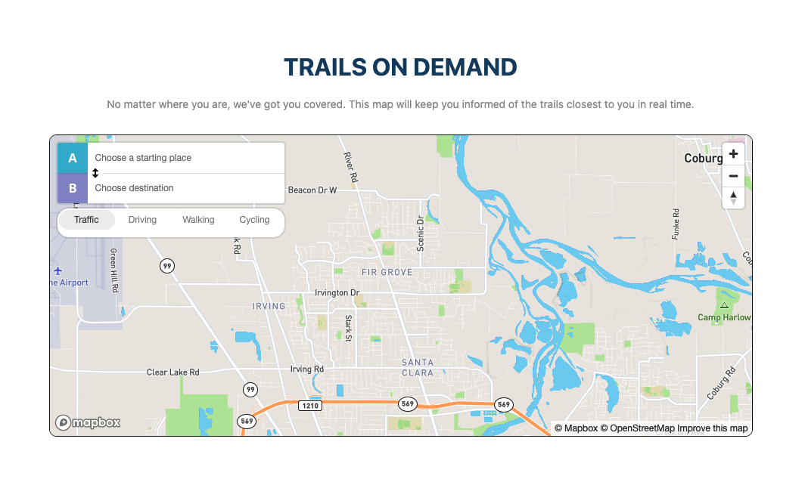
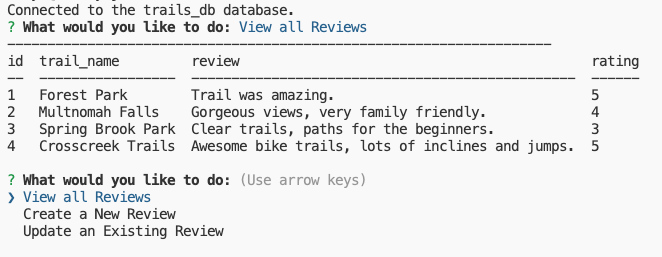

# Fails or Trails - Trail Finder Application

## Description
Trails or Fails aims to be the best trail app for the user, by the user. By providing our users with
the most useful trail information, we aim to be the first resource for their next adventure.

## MVPs

- Account Creation - Create an account username and password, encrypt password
- Trail Search/Trail Details - Use API for trail search and details
- Favorites Trails List - Use database to retrieve favorited trails
- Reviews - Use pull request to retrieve reviews

## Technologies Used
HTML, Javascript, CSS, SQL, Sequelize, Bootstrap

## Screenshots

## Links
* Deployed App: https://bleufox.github.io/trails-app/

## License
MIT

## Created By
* Kygan Dao, kygandao23@gmail.com
* Cedar Haloversen
* Karen Marting
* Ashley Jones, thebleufox8@gmail.com, 541.505.5287
